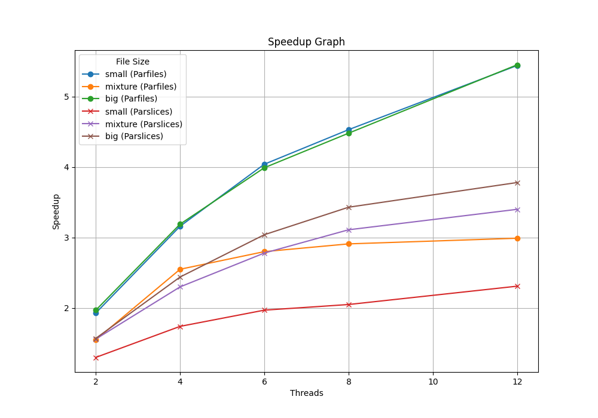

# Parallel Image Convolution

The goal of the project is to create an image editor that applies filters on series of images using 2D image convolutions. For understanding of image convolution, refer to [Kernel (image processing)](https://en.wikipedia.org/wiki/Kernel_(image_processing)).

To efficiently perform the image convolution, 3 different implementations approaches are attempted and performance is measured. 

1. Sequential (s) - 1 thread applying convolution effects sequentially on each image
2. Parallel Images (parfiles) - 1 thread for each image but multiple threads are processing concurrently on multiple images 
3. Parallel Slices (parslices) - Multiple threads operating on the same image, but images are processed sequentially. 

## Performance Analysis



Detailed time measurements are stored in *benchmark/slurm/out/measurements.txt* 

Cluster node specs: 
* 24 Cores (2x 24core Intel Xeon Silver 4116 CPU @ 2.10GHz), 48 threads
* 128gb RAM
* OS: 2x 240GB Intel SSD in RAID1
* /local: 2x 960GB Intel SSD RAID0 

### Sequential Program (s)
Each image is expected to apply at least 1 convolution effect, and each convolution effect requires iterating through each and every pixel and the neightboring pixel RBG and perform computation to get the resulting RGB for that pixel. Each effect is expected to take up roughly n x m x 9 computation, with n being rows and m being columns, which requires a lot of computations. Additionally, if there are multiple effects, each effect should take place only after previous effect is applied, as the next layer is based on the previous layer of pixel applied. Hence, we cannot iterate the grid once and apply the effects all at once. IO operations are required as this involves loading the input image and after applying the effect, we need to save and output a new image file. The areas that can be parallelized to solve the bottlenecks without compromising accuracy of the image are processing images in parallel and processing each image in parallel. 

### Parallel Images (parfiles)

Based on the result of the graph, there are increasing speed-ups across small, mixture and big images, with speedup going from 1.5x to 5.5x times. 

If there are only 2 threads, say if we are reusing threads, there might be around 5 cycles to process 10 images, which is why they are slowest. If there are 4 threads, it is roughly 2.5 cycles, 6-8 threads with 2 cycles, 12 threads with 1 cycle. Though not exactly the number of cycles expected above, it is reasonable to see more threads leading to high performance but somewhere in the middle of problem size of 10 images, there are not much difference. The performance spike in 12 threads is also reasonable because all threads can immediately process their images without waiting for other threads to complete theirs. 

It is surprising to see mixture has worst performance among all or put it another way the small image has better performance than mixture. There are two possible reasons, this might be due to cache misses in mixture as the size is larger, or another more probable reason is that actually the small images pixels are so small that they are cached easily, which leads to higher than expected performance. 

### Parallel Slices (parslices)

Based on the result, there are increasing performance across all image sizes, with about 1.3x to 3.8x speedup. 

It is reasonable to expect more threads lead to higher performance, because there are more workers working on the same image on their respective sections. Say originally 1 worker need to work on the image by itself but now there are 4 workers working on the same image in their respective non-overlapping section. It is reasonable to expect higher speedups with more threads. 

It is also noticed that bigger size image has higher performance because the overhead is proportionally smaller and there are more benefits to gain from the parallelization section.  

It is noted that increasing the number of threads by a big number does not actually proportionally leads to better performance. For instance, increasing the threads to 10 only lead to roughly 2x speedup. There are a few possible reasons for that: 1. overhead of parsing input files and requirements, putting jobs into the queue, setting up the threads to tell each thread which section they need to work on; 2. based on the total count of pixel that the thread is corresponded to, the thread needs to calculating which (x, y) position it is working on each time (to get the neighboring pixels). This step is put in place to minimize memory storage and iterating the grid before the thread starts working on anything; 3. we are not parallelizing images, meaning we process each image one by one; 4. effects cannot be parallized due to dependency. 

### Parallel Images vs Parallel Slices

Comparing parallel images and parallel slices, it appears that parallel image approach is more promising. There could be multiple reasons for this. 

There are only 10 input images. In parallel images, spawning more threads from 2 to 12, each thread is going to take up one image quickly sequentially and perform the processing in parallel, which is in contrast to parallel slices having multiple images waiting for images before them to complete processing first before they can be processed. In other words, there is a lot of waiting for the later images. 

Besides, in parallel images, there is very limited overhead to set up the threads to determine which part they are corresponding to, they just get the first image from the queue then execute their image, which is unlike parallel slices requiring clean calculation and delineation on what parts they are processing to prevent any race condition on the same pixel. 

Furthermore, in parallel slices, if some threads have finished their slice but some threads are slow, they will do nothing and wait for other threads to complete before they can take up the next chunk of the next effect or image, which is wasteful of resources. On the contrary, in parallel images, when the thread completes its work, it just takes whatever is left in the queue and continue working. 

### Problem Size and Performance 

While parallel images show promising result, problem size also impacts the performance. 

In parallel images, as there are only 10 images, spawning a few threads can quickly cover a large part or even full set of images (for 12 threads), meaning that no/very few images need to wait to be executed the processing. The wait cycle is pretty low. If you spawn 8 threads, you will probably need the first 2 threads to complete their processing before they can take up the final 2 images. If you spawn more than 10 threads, each thread can take up their image and execute straight away, hence explaining why there is a quick rise in performance when there are 12 threads. However, this benefit will stagnate very soon after the number of threads pass 10 because there are only 10 images and no 2 threads can work on more than 1 image, so more threads than the problem size are not needed. 

On the other hand, for parallel slices, there is a consistent rise in performance, which is reasonable because there are millions of pixels, you need a lot more than 12 threads to cover the problem size, like millions, so the performance speed up is supposed to go up much much longer than parallel images, and it is likely to be rising consistently for some time until the overhead is too high. 

### Alignment to Amdahl's law?

Parallel images has much poorer performance than expected from Amdahl's law. Based on the result, it is noted that a large part of time in the program execution is spent in the parallel portion >99%. The initial setup of parsiing requirements from input file, then setting up the job in queue is very minimal. The rest is just program execution, threads locking and unlocking the queue to take the job then run the jobs in parallel with other threads on different images. It is thus the reason there is a high proportion of time in parallel region, leading to high theorectically expected speedup. However, in actual practice, the performance is lower. It might be that there are multiple threads contending to take a job from the queue but the queue is locked, slowing down the actual execution. It could be that some threads execute very slowly as it happens to need to evict a lot of pages in memory to process the image when the image is not in cached. 

Parallel slices has much better speed up than expected from Amdahl's law. It is either the actual speedup is unexpectedly done well and/or the Amdahl's law speedup is understated. For the first one, this is rare in practice but could happen due to the reason that a lot of the pixels are cached coincidentally in the memory that is needed by the corresponding threads, which leads to the speedup. It is also noted that the parallel portion of time is going down as the number of threads increase, leading to the poorer theorectically speedup calculated from Amdahl's law. This might be due to the reason that there are more setup and overheads as the threads increase, leading to more time in sequential section (including the threads setup). 

### Improving performance 

There are a few approaches that could potentially improve the performance. Consider combining parallel images and parallel slices approach. If you have 20 threads but only 10 images and you do parallel images, 10 threads will be idle. Put that 10 threads to work together in pairs with the 10 other threads so that 2 threads work on 1 image, speeeding up the runtime. Potentially there can be two queues, one queue allowing threads to take up images not grabbed by any threads yet, then if this queue is empty and there are still threads in another queue for doubling performance, put those idle threads into use. Additionally, instead of having threads busy waiting, use condition variables that allows threads to suspend execution until they are allowed to take up the new images in the queue in parallel images case, or taking up new effects/images after they complete their parallel chunks and waiting for other threads to complete. 

## How to run the scripts
1. Python code will be used to create a speedup graph. In *parallel-image-processing* directory, run the following to set up Python virtual environment
```terminal
python -m venv env
```
2. Activate the virtual environment with the following
```terminal
source env/bin/activate
```
3. In *parallel-image-processing* directory, run the following to install the Python libraries for generating graph. 
```terminal
pip install -r requirements.txt
```
4. Change directory to data directory and create an output directory for the processed images
```terminal
cd data
mkdir out
```
5. If you have not installed OpenCV, install OpenCV first. For example:
```terminal
brew install opencv
```
6. If you have not installed cmake, install cmake first. For example:
```terminal
brew install cmake
```
7. Make a build directory in *parallel-image-processing* directory and run the following to build the C++ code
```terminal
mkdir build
cd build
cmake ..
make
```
8. For just running the script for the image processing tasks for testing, there are different settings available. Note that size can be configured to run multiple file sizes e.g. small+mixture will run small and mixture. Mode s means running sequential version, parfiles means running multiple files in parallel, parslices means running multiple threads on each image. Images processed will be available in *data/out*. 
```terminal
cd build
./Parallel-Image-Processing editor <size: small | mixture | big> <mode: s | parfiles | parslices> <number of threads>

```
9. For measuring performance and generating the speedup graph, create the slurm folders and modify *benchmark.sh* and *graph.py* accordingly for the appropriate file paths, input and output file names. 
```terminal
cd benchmark
mkdir slurm
cd slurm
mkdir out
mkdir err
```
10. Run the job in cluster. Speedup results will be available in *benchmark/slurm/out* directory and images processed will be available in *data/out*. 
```terminal
cd benchmark
sbatch benchmark.sh
```
11. When ready to exit, run the following to deactivate the Python virtual environment 
```terminal
deactivate
```

## Folder structure

- **benchmark**: Contains the measurement of time it takes to process the images using the 3 techniques, the scripts to run the benchmarking and generating the speedup graph.
- **src**: Contains the source code for the image processing.
- **include**: Contains the header files for the image processing.
- **lib**: Contains the libraries for parsing json.
- **data**: Contains the images to be processed and the output images.
- **build**: Contains the compiled code for the image processing. (To be created per instruction above)
- **env**: Contains the Python virtual environment for generating the speedup graph. (Folder is autocreated once a virtual environment is created)
- **CMakeLists.txt**: Contains the cmake configuration for building the C++ code.
- **requirements.txt**: Contains the Python libraries required for generating the speedup graph.